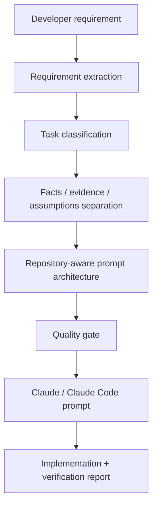

# Claude Prompt Architect

> Turn conversational engineering requirements into implementation-ready prompts for Claude and Claude Code.

<p align="center">
  <a href="#english">🇬🇧 English</a>
  &nbsp;•&nbsp;
  <a href="#فارسی">🇮🇷 فارسی</a>
</p>

<a id="english"></a>


Claude Prompt Architect is a reusable prompt-engineering skill designed for software engineers who already know **what they want to build**, but do not want to spend time manually turning that requirement into a precise, repository-aware Claude / Claude Code prompt.

It accepts engineering requirements in **Persian or English**, extracts the real implementation intent, separates facts from assumptions, adds investigation and verification requirements, and produces a structured prompt that is ready to hand off to Claude Code.

---

## Why this exists

Most coding-agent failures do not start with bad code. They start with vague instructions.

A requirement like:

> وقتی کاربر چند بار روی دکمه Save کلیک می‌کنه، چند درخواست همزمان ارسال می‌شه. می‌خوام تا وقتی درخواست قبلی تمام نشده، درخواست جدید ارسال نشه.

is understandable to a human engineer, but it still leaves several implementation questions implicit:

- Where is the save action actually owned?
- Is duplicate submission caused by UI state, event handling, async flow, or request orchestration?
- Does the project already have a loading or submission-state pattern that should be reused?
- What behavior must remain unchanged after the fix?
- How should duplicate requests be verified?
- What should Claude report after finishing?

Claude Prompt Architect expands that conversational requirement into a prompt that explicitly asks the downstream agent to:

1. inspect the real implementation,
2. trace the request flow,
3. identify the root cause,
4. preserve working behavior,
5. make the smallest correct change,
6. run relevant verification,
7. and report what actually passed, failed, or was not run.

The goal is not to make prompts longer.

The goal is to make them **less ambiguous, more repository-grounded, and easier to verify**.

---

## Core idea

The plugin uses a full semantic prompt architecture:

```text
Role
Goal
Context
Inputs / References
Constraints
Actions
Verification
Output
Success Criteria
```

For day-to-day use, it can express the same architecture through a simpler four-part format called **GCAO**:

```text
Goal → Contexts → Actions → Outputs
```

GCAO is not a stripped-down prompt format. It is a compact mapping over the full engineering structure.

| GCAO section | Contains |
| --- | --- |
| **Goal** | Role + desired engineering outcome |
| **Contexts** | Current behavior, expected behavior, references, inputs, constraints |
| **Actions** | Investigation, preflight, implementation, correction, verification |
| **Outputs** | Engineering report, validation results, Definition of Done |

---

## How it works



The skill does **not** assume facts about the target repository.

If a path, service, component, command, API field, or architecture detail has not been provided, the generated prompt tells Claude Code to discover the real implementation instead of inventing it.

---

## Main workflows

### 1. Feature implementation

For new engineering work, the skill turns a conversational request into an implementation-ready task with:

- explicit expected behavior,
- repository preflight,
- scope boundaries,
- reuse of existing project patterns,
- verification,
- Definition of Done.

### 2. Bug fix

Bug-fix prompts are root-cause-first.

Claude is instructed to inspect the actual execution, state, event, lifecycle, or data flow before changing implementation.

The generated prompt discourages symptom-only patches such as arbitrary flags, timers, guards, or test-specific workarounds unless they are genuinely the correct architectural solution.

### 3. Existing implementation alignment

Useful when the requirement says:

- “make this form behave like the existing profile form”
- “use the current upload flow as the reference”
- “reuse the existing confirmation dialog”
- “match the pagination behavior used elsewhere in the application”

The prompt tells Claude to inspect the reference implementation and reuse only the relevant:

- architecture,
- state flow,
- services,
- interaction behavior,
- styling,
- loading behavior,
- error handling,
- theme support,
- tests.

It does not blindly copy unrelated behavior.

### 4. Correction Prompt

Sometimes Claude says the work is finished, but the result is incomplete or incorrect.

Correction mode builds a delta-oriented prompt instead of restarting the whole feature.

It separates items into:

| Status | Meaning |
| --- | --- |
| **Correct / keep** | Existing work that should remain untouched |
| **Missing / add** | Required behavior that was never implemented |
| **Incorrect / fix** | Existing behavior that conflicts with the requirement |
| **Uncertain / inspect** | Claims that must be verified against the repository |

### 5. Engineering report continuation

Claude engineering reports are treated as **reported claims**, not automatically verified facts.

The next prompt asks Claude to reconcile that report with the current repository and continue only the remaining or incorrect work.

Typical continuation flow:

```text
Previous engineering report
        ↓
Reported completed work
        ↓
Repository verification
        ↓
Keep / correct / continue
        ↓
Fresh verification
        ↓
Updated engineering report
```

### 6. GCAO mode

For engineers who prefer compact prompts:

```text
Goal
Contexts
Actions
Outputs
```

The same investigation, scope, verification, and success criteria are preserved underneath those four sections.

---

## Example

### Input

```text
وقتی کاربر چند بار روی دکمه Save کلیک می‌کنه، چند request همزمان ارسال می‌شه.
تا وقتی request قبلی تموم نشده نباید request جدیدی ارسال بشه.
```

### Generated prompt shape

```markdown
## Goal

Prevent duplicate save requests while preserving the existing save behavior.

## Contexts

The current implementation allows repeated user interaction to trigger multiple
concurrent requests for the same action.

The exact component, service, event flow, and request owner must be discovered
from the repository rather than assumed.

Preserve the normal successful save flow and existing error handling.

## Actions

- Inspect the current save action and request flow.
- Trace the UI event, submission state, async handling, and request ownership.
- Identify the actual root cause of duplicate submissions.
- Reuse any existing loading or submission-state pattern already established in the project.
- Implement the minimal fix at the correct ownership boundary.
- Avoid arbitrary delays or timer-based workarounds.
- Verify that repeated clicks do not create concurrent duplicate requests.
- Verify that a new save can occur normally after the previous request completes.

## Outputs

Provide:
- root cause
- files changed
- implementation summary
- verification performed
- passed / failed / not-run checks
- remaining limitations
```

The real generated prompt can be more detailed depending on the requirement and available repository context.

---

## Supported engineering tasks

Claude Prompt Architect can structure prompts for:

- feature implementation
- bug fixing
- UI changes
- API integration
- refactoring
- regression fixes
- data visualization
- performance investigation
- security work
- testing
- architecture changes
- code audits
- existing implementation alignment
- correction prompts
- continuation from previous engineering reports

It is framework-aware without forcing a specific architecture.

Examples include:

- Angular
- TypeScript / JavaScript
- RxJS
- Angular Material
- Android / Java / Kotlin
- Node.js
- backend APIs
- ECharts
- Konva.js
- MapLibre
- Three.js

---

## Design principles

### Investigate before editing

Generated coding prompts tell Claude Code to inspect the real implementation first.

### Root cause before workaround

Bug fixes should address the ownership boundary that actually causes the issue.

### Reuse before reinvention

Existing services, components, dialogs, helpers, patterns, and abstractions should be reused when they already solve the problem.

### Preserve exact contracts

Provided technical identifiers stay unchanged:

- API paths
- HTTP methods
- DTO/property names
- enum values
- filenames
- component names
- literal values
- casing

### No invented repository facts

If a path or implementation detail is unknown, the prompt asks Claude Code to discover it.

### Scope control

Generated prompts discourage unrelated:

- refactoring
- dependency upgrades
- formatting sweeps
- architecture migrations
- speculative cleanup
- test rewrites

### Verification is part of the task

A coding task is not considered complete merely because code was changed.

Generated prompts explicitly request relevant:

- targeted tests
- type checking
- linting
- build/AOT/compile validation
- regression scenarios
- final diff inspection

The downstream engineering report must distinguish:

```text
passed
failed
not run
```

---

## Quality gate

Before a prompt is delivered, the skill evaluates whether the generated instructions cover:

- requirement completeness
- user intent
- evidence vs assumptions
- technical identifier fidelity
- architecture completeness
- root-cause diagnosis
- preservation of existing work
- reference usage
- scope control
- reuse
- domain-specific concerns
- verification
- reporting
- clarity

This is a prompt-quality check, not a claim that the downstream implementation will always be correct.

---

## Repository structure

```text
.
├── claude-prompt-architect/
│   ├── skill.md
│   └── references/
│       ├── prompt-standard.md
│       ├── modes-and-gcao.md
│       ├── quality-checklist.md
│       └── examples.md
├── docs/
│   └── angular-cafe-telegram-post-fa.md
├── .github/
│   ├── ISSUE_TEMPLATE/
│   │   └── bug-report.md
│   └── PULL_REQUEST_TEMPLATE.md
├── scripts/
│   └── publish.sh
├── CONTRIBUTING.md
├── SECURITY.md
├── LICENSE
├── .gitignore
└── README.md
```

---

## Installation / usage

This repository contains the source of the Claude Prompt Architect skill.

The exact way a custom skill/plugin is installed or exposed inside ChatGPT can depend on the current ChatGPT workspace/plugin capabilities.

The repository is intentionally separated from that installation mechanism:

- the GitHub repo is the source of truth,
- `skill.md` defines the skill behavior,
- `references/` contains the reusable prompt architecture and examples.

If you are using an environment that supports custom ChatGPT skills/plugins, import or package this repository according to that environment's supported plugin workflow.

Do **not** assume that cloning this repository alone installs it into ChatGPT.

Once the skill is available in ChatGPT, use it with an engineering requirement such as:

```text
@Claude Prompt Architect

وقتی کاربر چند بار روی دکمه Save کلیک می‌کنه چند request همزمان ارسال می‌شه.
تا وقتی request قبلی تموم نشده نباید request جدیدی ارسال بشه.
```

The output is an implementation-ready prompt intended for Claude / Claude Code.

---

## Example scenarios

### Feature

```text
@Claude Prompt Architect

Add file upload support to the account settings form.
Reuse the application's existing upload component and validation patterns
instead of creating a second upload implementation.
```

### Bug fix

```text
@Claude Prompt Architect

Clicking Save repeatedly can send duplicate requests.
Only one submission should be active at a time, and the user must be able
to save again after the previous request finishes.
```

### Existing implementation alignment

```text
@Claude Prompt Architect

Make the new profile form follow the same validation, loading,
error handling, and accessibility behavior as the existing account form.
Reuse established project patterns where applicable.
```

### Correction

```text
@Claude Prompt Architect

Claude reports that the form validation is complete, but server-side errors
are still not displayed next to the affected fields.
Keep the parts that are already correct and fix only the remaining behavior.
```

### Continuation

```text
@Claude Prompt Architect

Here is Claude's previous engineering report.
Verify its claims against the current repository and continue only the
remaining or incorrect work.
```

---

## What this project is not

Claude Prompt Architect is not:

- a replacement for repository inspection,
- a guarantee that an AI coding agent will implement a task correctly,
- a generic “make my prompt better” formatter,
- a tool that invents missing API or repository details,
- a substitute for testing and engineering review.

Its job is to create a better **engineering contract** between the developer and the coding agent.

---

## Contributing

Contributions are welcome for:

- new engineering scenarios,
- better prompt-quality checks,
- additional framework-specific examples,
- correction/continuation workflows,
- clearer documentation.

See [CONTRIBUTING.md](CONTRIBUTING.md).

---

## Security

Please do not include proprietary code, credentials, internal URLs, access tokens, or private repository data in public examples or issues.

See [SECURITY.md](SECURITY.md).

---

## License

MIT License. See [LICENSE](LICENSE).

---

<a id="فارسی"></a>

# 🇮🇷 راهنمای فارسی

> Claude Prompt Architect یک skill برای تبدیل requirementهای فنی فارسی یا انگلیسی به promptهای دقیق و آماده‌ی اجرا برای Claude و Claude Code است.

<p align="center">
  <a href="#english">⬆️ English</a>
  &nbsp;•&nbsp;
  <a href="#فارسی">🇮🇷 فارسی</a>
</p>

## 🎯 این پروژه دقیقاً چه کاری می‌کند؟

خیلی وقت‌ها خود برنامه‌نویس دقیقاً می‌داند چه تغییری می‌خواهد، اما requirement اولیه هنوز برای یک coding agent بیش از حد مبهم است.

مثلاً:

```text
وقتی کاربر چند بار روی دکمه Save کلیک می‌کنه چند request همزمان ارسال می‌شه.
تا وقتی request قبلی تموم نشده نباید request جدیدی ارسال بشه.
```

برای یک برنامه‌نویس باتجربه، منظور تقریباً مشخص است؛ اما برای Claude هنوز چند سؤال مهم وجود دارد:

- 🧩 مسئول اصلی این رفتار کدام component، service یا state layer است؟
- 🔍 مشکل از event handling است، loading state است یا request orchestration؟
- ♻️ آیا داخل پروژه pattern مشابهی وجود دارد که باید reuse شود؟
- 🛡️ چه رفتارهایی نباید با fix جدید تغییر کنند؟
- ✅ دقیقاً چه سناریوهایی باید verify شوند؟
- 📋 Claude در پایان باید چه گزارشی ارائه کند؟

Claude Prompt Architect این requirement اولیه را به یک **engineering contract** دقیق‌تر تبدیل می‌کند.

---

## 🧠 معماری Prompt

ساختار کامل semantic prompt به شکل زیر است:

```text
Role
Goal
Context
Inputs / References
Constraints
Actions
Verification
Output
Success Criteria
```

اما برای استفاده روزمره، این ساختار می‌تواند در قالب مدل ساده‌تر **GCAO** ارائه شود:

```text
Goal → Contexts → Actions → Outputs
```

### 🧭 GCAO چیست؟

| بخش | شامل چه چیزهایی می‌شود؟ |
| --- | --- |
| 🎯 **Goal** | Role + هدف نهایی |
| 🧩 **Contexts** | وضعیت فعلی، expected behavior، referenceها، inputها و constraintها |
| 🛠️ **Actions** | investigation، preflight، implementation، correction و verification |
| 📦 **Outputs** | engineering report، نتیجه validation و Definition of Done |

GCAO قرار نیست prompt را سطحی‌تر کند؛ فقط ساختار کامل را به شکلی خواناتر و سریع‌تر برای استفاده روزمره مرتب می‌کند.

---

## ⚙️ Workflow اصلی

```text
Requirement
    ↓
Requirement Extraction
    ↓
Task Classification
    ↓
Facts / Evidence / Assumptions
    ↓
Prompt Architecture
    ↓
Quality Gate
    ↓
Claude / Claude Code Prompt
    ↓
Implementation + Verification Report
```

---

## 🚀 چه سناریوهایی را پشتیبانی می‌کند؟

### ✨ Feature Implementation

برای featureهای جدید:

- رفتار مورد انتظار را شفاف می‌کند.
- Claude را مجبور می‌کند اول repository را inspect کند.
- scope تغییرات را محدود می‌کند.
- reuse کردن patternهای موجود پروژه را در اولویت می‌گذارد.
- verification و Definition of Done مشخص می‌کند.

---

### 🐛 Bug Fix

در bug fixها رویکرد اصلی **root-cause-first** است.

یعنی Claude باید قبل از تغییر کد:

- execution flow را بررسی کند،
- state و event flow را trace کند،
- مالک واقعی رفتار را پیدا کند،
- بعد در همان ownership boundary مشکل را برطرف کند.

هدف این است که fix فقط یک workaround موقتی مثل timer، flag یا guard تصادفی نباشد.

---

### ♻️ Existing Implementation Alignment

وقتی requirement چیزی شبیه این است:

```text
این فرم باید مثل فرم موجود validation و loading داشته باشه.
```

یا:

```text
از confirmation dialog فعلی پروژه reuse کن.
```

Prompt Architect به Claude می‌گوید اول reference واقعی را inspect کند و فقط behaviorهای مرتبط را reuse کند.

نه اینکه implementation جدید و موازی بسازد.

---

### 🩹 Correction Prompt

اگر Claude قبلاً کاری را ناقص یا اشتباه انجام داده باشد، لازم نیست دوباره کل feature از صفر prompt شود.

Correction mode کار را به این چهار دسته تقسیم می‌کند:

| وضعیت | معنی |
| --- | --- |
| ✅ **Correct / keep** | درست است و باید حفظ شود |
| ➕ **Missing / add** | وجود ندارد و باید اضافه شود |
| 🛠️ **Incorrect / fix** | وجود دارد ولی اشتباه است |
| 🔎 **Uncertain / inspect** | باید در repository بررسی شود |

این باعث می‌شود Claude فقط روی **delta واقعی** کار کند.

---

### 🔄 Engineering Report Continuation

اگر Claude قبلاً engineering report داده باشد، Prompt Architect آن report را حقیقت قطعی فرض نمی‌کند.

مثلاً:

```text
Typecheck passed.
Build passed.
Browser verification was not run.
```

Prompt بعدی باید:

1. claimهای report را با repository فعلی مقایسه کند،
2. بخش‌های درست را نگه دارد،
3. فقط قسمت‌های ناقص یا اشتباه را ادامه دهد،
4. verification جدید را از verification قبلی جدا گزارش کند.

---

## 🧪 یک مثال عمومی

### Requirement اولیه

```text
وقتی کاربر چند بار روی Save کلیک می‌کنه چند request همزمان ارسال می‌شه.
تا وقتی request قبلی تموم نشده نباید request جدیدی ارسال بشه.
```

### چیزی که Prompt Architect از آن استخراج می‌کند

```text
🎯 Goal
Prevent duplicate save requests.

🧩 Contexts
Discover the actual save owner and current async/request flow.
Preserve normal save behavior and existing error handling.

🛠️ Actions
Inspect event handling.
Trace submission state.
Find root cause.
Reuse existing project patterns.
Apply the minimal fix.
Verify repeated clicks do not trigger concurrent requests.

📦 Outputs
Root cause
Files changed
Implementation summary
Verification performed
Passed / failed / not-run checks
Remaining limitations
```

---

## 🛡️ Anti-Hallucination

یکی از مهم‌ترین اصول این skill این است که درباره repository چیزی از خودش نسازد.

اگر اطلاعاتی داده نشده باشد، نباید مواردی مثل این‌ها را حدس بزند:

- 📁 file path
- 🧱 component name
- ⚙️ service name
- 🌐 API endpoint
- 📦 DTO field
- 🧾 request / response structure
- 🧪 test command
- 🏗️ project architecture

در عوض باید Claude Code را موظف کند implementation واقعی را از repository پیدا کند.

---

## 🔒 Scope Control

Promptهای تولیدشده Claude را از تغییرات نامرتبط دور نگه می‌دارند.

مثلاً تا وقتی لازم نباشد، نباید سراغ این موارد برود:

- refactorهای نامرتبط
- dependency upgrade
- architecture migration
- formatting sweep
- renameهای غیرضروری
- test rewrite
- speculative cleanup

هدف این است که diff نهایی تا حد ممکن کوچک، قابل‌بررسی و مرتبط با requirement اصلی باشد.

---

## ✅ Verification

تغییر کد به‌تنهایی به معنی تمام شدن task نیست.

بسته به پروژه، prompt می‌تواند Claude را موظف کند موارد مرتبط را بررسی کند:

- 🧪 targeted tests
- 🧷 type checking
- 🧹 lint
- 🏗️ build / compile / AOT
- 🔁 regression scenarios
- 👀 final diff inspection

و در پایان باید دقیقاً مشخص شود:

```text
✅ passed
❌ failed
➖ not run
```

نه اینکه verification اجرا نشده باشد ولی در report به‌عنوان موفق ثبت شود.

---

## 🧰 استفاده

اگر محیط ChatGPT شما امکان استفاده از custom skill/plugin را داشته باشد، سورس اصلی skill در این repository قرار دارد:

```text
claude-prompt-architect/
├── skill.md
└── references/
    ├── prompt-standard.md
    ├── modes-and-gcao.md
    ├── quality-checklist.md
    └── examples.md
```

> ⚠️ صرف clone کردن repository به معنی نصب خودکار plugin داخل ChatGPT نیست. روش نصب به قابلیت‌های فعلی workspace یا plugin system شما بستگی دارد.

بعد از در دسترس قرار گرفتن skill، می‌توانید requirement را به این شکل بدهید:

```text
@Claude Prompt Architect

وقتی کاربر چند بار روی دکمه Save کلیک می‌کنه چند request همزمان ارسال می‌شه.
تا وقتی request قبلی تموم نشده نباید request جدیدی ارسال بشه.
```

خروجی، یک prompt ساختاریافته و implementation-ready برای Claude / Claude Code خواهد بود.

---

## 🧩 چند نمونه استفاده

### ✨ Feature

```text
@Claude Prompt Architect

به صفحه تنظیمات امکان upload فایل اضافه کن.
از upload component و validation pattern موجود پروژه استفاده کن.
```

### 🐛 Bug Fix

```text
@Claude Prompt Architect

با چند بار کلیک روی Save چند request همزمان ارسال می‌شه.
تا وقتی request فعلی تمام نشده درخواست جدید ارسال نشه.
```

### ♻️ Alignment

```text
@Claude Prompt Architect

فرم جدید باید از نظر validation، loading، error handling
و accessibility مثل فرم موجود پروژه رفتار کنه.
```

### 🩹 Correction

```text
@Claude Prompt Architect

Claude گفته validation کامل شده،
ولی server-side error هنوز کنار field مربوطه نمایش داده نمی‌شه.
قسمت‌های درست رو نگه دار و فقط بخش ناقص رو اصلاح کن.
```

### 🔄 Continuation

```text
@Claude Prompt Architect

این engineering report قبلی Claude هست.
claimهاش رو با repository فعلی verify کن
و فقط کارهای باقی‌مونده یا اشتباه رو ادامه بده.
```

---

## 💡 هدف اصلی پروژه

Claude Prompt Architect قرار نیست جای review مهندسی یا repository inspection را بگیرد.

هدفش این است که ارتباط بین:

```text
Developer Intent
        ↕
Claude / Claude Code
```

به یک قرارداد فنی دقیق‌تر تبدیل شود؛ قراردادی که در آن:

- هدف مشخص است،
- context مشخص است،
- assumptionها از factها جدا هستند،
- scope کنترل شده است،
- verification بخشی از task است،
- و نتیجه‌ی نهایی قابل بررسی‌تر است.

---

<p align="center">
  <strong>🧠 Better requirements → Better prompts → Better engineering handoffs</strong>
</p>

<p align="center">
  <a href="#english">⬆️ بازگشت به نسخه انگلیسی</a>
</p>

